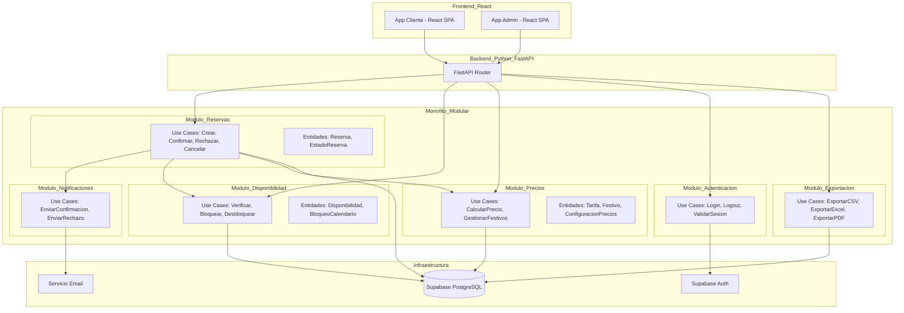

# Documento de Diseño: Sistema de Reservas de Guardería Canina

## Visión General

El sistema de reservas de guardería canina es una aplicación web que permite a los clientes reservar servicios para sus mascotas (paseos, guardería diurna y alojamiento) y al empresario gestionar dichas reservas, configurar precios y controlar la disponibilidad.

El sistema actual está implementado como una aplicación frontend estática con JavaScript vanilla conectada directamente a Supabase. La arquitectura objetivo evoluciona hacia un **Monolito Modular con Clean Architecture**, con un frontend en **React (JavaScript)** y un backend en **Python (FastAPI)**, manteniendo la simplicidad operacional de un único despliegue mientras establece límites claros entre módulos de negocio y separa las capas de dominio, aplicación e infraestructura.

### Justificación de la Arquitectura

El dominio de una guardería canina presenta una complejidad moderada pero bien delimitada:
- Reglas de negocio estables: cálculo de precios, gestión de disponibilidad, ciclo de vida de reservas.
- Múltiples actores con responsabilidades distintas: cliente, empresario, sistema de notificaciones.
- Requisitos de integridad transaccional: una reserva debe actualizar disponibilidad de forma atómica.
- Necesidad de auditoría y trazabilidad de cambios de estado.

Estos factores justifican un núcleo de dominio aislado y estable, protegido de los detalles de infraestructura.

---

## Arquitectura

### Decisiones Arquitectónicas (ADR)

#### ADR-001: Monolito Modular como estilo arquitectónico

**Estado:** Aceptado

**Contexto:** El sistema es operado por un único empresario, con carga de usuarios moderada y equipo de desarrollo pequeño. La complejidad operacional de microservicios no está justificada.

**Decisión:** Se adopta el patrón de **Monolito Modular**: un único proceso desplegable dividido internamente en módulos con límites bien definidos. Cada módulo expone una API pública (interfaces) y oculta sus detalles de implementación.

**Consecuencias:**
- Despliegue simple: un único artefacto.
- Comunicación entre módulos mediante interfaces en memoria, sin latencia de red.
- Los módulos pueden evolucionar de forma independiente y extraerse como servicios en el futuro si fuera necesario.
- Se evita la complejidad de la consistencia eventual entre servicios distribuidos.

#### ADR-002: Clean Architecture como patrón de organización interna

**Estado:** Aceptado

**Contexto:** La lógica de negocio (cálculo de precios, validación de disponibilidad, ciclo de vida de reservas) debe ser independiente del framework, la base de datos y los mecanismos de entrega.

**Decisión:** Se aplica **Clean Architecture** dentro de cada módulo. El backend en Python (FastAPI) organiza las capas concéntricas:

```
+---------------------------------------------+
|              Infraestructura                |  <- Supabase, Email, FastAPI routers
|  +---------------------------------------+  |
|  |           Adaptadores                 |  |  <- Controllers, Repositories impl.
|  |  +-------------------------------+    |  |
|  |  |         Aplicación            |    |  |  <- Use Cases, DTOs (dicts/dataclasses)
|  |  |  +-------------------------+  |    |  |
|  |  |  |        Dominio          |  |    |  |  <- Entities, Value Objects, Rules
|  |  |  +-------------------------+  |    |  |
|  |  +-------------------------------+    |  |
|  +---------------------------------------+  |
+---------------------------------------------+
```

**Regla de dependencia:** Las capas internas no conocen las capas externas. El dominio no importa nada de aplicación ni infraestructura.

**Consecuencias:**
- La lógica de negocio es testeable sin base de datos ni framework.
- Se puede cambiar Supabase por otra base de datos sin tocar el dominio.
- Mayor verbosidad inicial compensada por mantenibilidad a largo plazo.

#### ADR-003: Supabase como capa de persistencia e identidad

**Estado:** Aceptado

**Decisión:** Supabase actúa como proveedor de infraestructura para persistencia (PostgreSQL), autenticación (Auth) y notificaciones en tiempo real. Los repositorios del dominio abstraen el acceso a Supabase mediante interfaces.

**Consecuencias:**
- Dependencia de proveedor externo gestionada mediante el patrón Repository.
- Row Level Security de Supabase refuerza el requisito 12.3 (acceso restringido a datos personales).

#### ADR-005: Stack tecnológico

**Estado:** Aceptado

**Decisión:**

| Capa | Tecnología | Justificación |
|------|-----------|---------------|
| Frontend cliente | React (JavaScript) | Componentes reutilizables, ecosistema maduro, SPA sin necesidad de SSR |
| Frontend admin | React (JavaScript) | Panel de administración como SPA independiente o rutas protegidas |
| Backend | Python + FastAPI | Tipado opcional con type hints, rendimiento async, ecosistema rico para email y exportación |
| Base de datos | Supabase (PostgreSQL) | Persistencia, autenticación y RLS ya integrados |
| Email | SMTP / SendGrid via Python | Librería `smtplib` o `sendgrid` en el backend |
| Exportación | `openpyxl`, `reportlab`, `csv` (Python) | Librerías nativas sin dependencias externas complejas |

**Consecuencias:**
- El frontend React consume la API REST del backend Python via `fetch` / `axios`.
- No hay TypeScript: los contratos de API se documentan como esquemas JSON/OpenAPI.
- El backend Python gestiona toda la lógica de negocio, notificaciones y exportación.

#### ADR-004: Módulos de negocio como unidades de organización

**Estado:** Aceptado

**Decisión:** El sistema se organiza en los siguientes módulos de negocio:

| Módulo | Responsabilidad |
|--------|----------------|
| `reservas` | Ciclo de vida completo de una reserva |
| `disponibilidad` | Control de plazas y bloqueos de calendario |
| `precios` | Tarifas, festivos y cálculo de precio total |
| `notificaciones` | Envío de emails transaccionales |
| `autenticacion` | Sesiones del empresario |
| `exportacion` | Generación de informes en CSV/Excel/PDF |


---

### Diagrama de Arquitectura General



---

## Componentes e Interfaces

### Contratos de Comunicación entre Módulos

Los módulos del backend Python se comunican mediante clases Python (`dataclasses`) y protocolos (`Protocol`). Los contratos entre frontend React y backend se documentan como esquemas JSON (OpenAPI).

#### Contrato del Módulo de Disponibilidad (Python)

```python
from dataclasses import dataclass
from datetime import date
from typing import Protocol

@dataclass
class ResultadoDisponibilidad:
    disponible: bool
    plazas_por_dia: dict[str, int]  # fecha ISO -> plazas libres
    dias_sin_disponibilidad: list[date]

class IDisponibilidadService(Protocol):
    async def verificar_disponibilidad_rango(
        self, servicio: str, fecha_desde: date, fecha_hasta: date
    ) -> ResultadoDisponibilidad: ...

    async def reservar_plazas(self, servicio: str, fecha_desde: date, fecha_hasta: date) -> None: ...
    async def liberar_plazas(self, servicio: str, fecha_desde: date, fecha_hasta: date) -> None: ...
    async def bloquear_dia(self, servicio: str, fecha: date) -> None: ...
    async def desbloquear_dia(self, servicio: str, fecha: date) -> None: ...
```

#### Contrato del Módulo de Precios (Python)

```python
@dataclass
class ParametrosCalculo:
    servicio: str          # 'paseos' | 'guarderia' | 'alojamiento'
    tarifa: str            # 'normal' | 'cachorros'
    fecha_desde: date
    fecha_hasta: date
    perro_extra: bool
    transporte: str | None  # 'sin-transporte' | 'recogida' | 'recogida-entrega'

@dataclass
class DesglosePrecio:
    precio_base: float
    costo_perro_extra: float
    costo_transporte: float
    recargo_festivos: float
    total: float
    dias_festivos: list[date]

class IPreciosService(Protocol):
    async def calcular_precio_total(self, params: ParametrosCalculo) -> DesglosePrecio: ...
    async def obtener_configuracion(self, servicio: str) -> dict: ...
    async def actualizar_configuracion(self, config: dict) -> None: ...
    async def es_festivo(self, fecha: date) -> bool: ...
```

#### Contrato del Módulo de Notificaciones (Python)

```python
class INotificacionesService(Protocol):
    async def notificar_nueva_reserva(self, reserva: dict) -> None: ...
    async def notificar_confirmacion(self, reserva: dict) -> None: ...
    async def notificar_rechazo(self, reserva: dict) -> None: ...
    async def notificar_cancelacion(self, reserva: dict) -> None: ...
    async def notificar_empresario(self, reserva: dict, evento: str) -> None: ...
```

### API HTTP (Contratos de Entrega)

Los endpoints siguen convenciones REST. Todos los endpoints del panel admin requieren autenticación.

#### Endpoints Públicos (Cliente)

| Método | Ruta | Descripción |
|--------|------|-------------|
| `GET` | `/api/disponibilidad/:servicio/:mes` | Disponibilidad mensual |
| `GET` | `/api/precios/:servicio` | Precios vigentes |
| `GET` | `/api/festivos` | Días festivos activos |
| `POST` | `/api/reservas` | Crear nueva reserva |

#### Endpoints Privados (Empresario)

| Método | Ruta | Descripción |
|--------|------|-------------|
| `GET` | `/api/admin/reservas` | Listar reservas con filtros |
| `GET` | `/api/admin/reservas/:id` | Detalle de reserva |
| `PATCH` | `/api/admin/reservas/:id/confirmar` | Confirmar reserva |
| `PATCH` | `/api/admin/reservas/:id/rechazar` | Rechazar reserva |
| `PATCH` | `/api/admin/reservas/:id/cancelar` | Cancelar reserva |
| `PUT` | `/api/admin/reservas/:id` | Modificar reserva |
| `POST` | `/api/admin/disponibilidad/bloquear` | Bloquear día |
| `POST` | `/api/admin/disponibilidad/desbloquear` | Desbloquear día |
| `PUT` | `/api/admin/precios` | Actualizar precios |
| `GET` | `/api/admin/exportar` | Exportar reservas |
| `POST` | `/api/admin/festivos` | Añadir festivo |
| `DELETE` | `/api/admin/festivos/:id` | Eliminar festivo |


---

## Modelos de Datos

### Entidades de Dominio (Python - Backend)

#### Reserva

```python
from dataclasses import dataclass, field
from datetime import date, datetime
from enum import Enum

class EstadoReserva(str, Enum):
    PENDIENTE = 'pendiente'
    CONFIRMADA = 'confirmada'
    RECHAZADA = 'rechazada'
    CANCELADA = 'cancelada'

class TipoServicio(str, Enum):
    PASEOS = 'paseos'
    GUARDERIA = 'guarderia'
    ALOJAMIENTO = 'alojamiento'

class TipoTarifa(str, Enum):
    NORMAL = 'normal'
    CACHORROS = 'cachorros'

class TipoTransporte(str, Enum):
    SIN_TRANSPORTE = 'sin-transporte'
    RECOGIDA = 'recogida'
    RECOGIDA_ENTREGA = 'recogida-entrega'

@dataclass
class DatosCliente:
    nombre: str
    telefono: str
    email: str
    direccion: str | None = None

@dataclass
class DatosMascota:
    nombre: str
    tamano: str  # 'cachorro' | 'pequeño' | 'mediano' | 'grande'
    raza: str | None = None
    notas: str | None = None

@dataclass
class Reserva:
    id: str
    servicio: TipoServicio
    fecha_desde: date
    fecha_hasta: date
    tarifa: TipoTarifa
    tramo_horario: str
    perro_extra: bool
    estado: EstadoReserva
    precio_total: float
    cliente: DatosCliente
    mascota: DatosMascota
    creada_en: datetime
    actualizada_en: datetime
```

#### Modelos de dominio en el frontend React (JSDoc)

```js
/**
 * @typedef {'pendiente'|'confirmada'|'rechazada'|'cancelada'} EstadoReserva
 * @typedef {'paseos'|'guarderia'|'alojamiento'} TipoServicio
 * @typedef {'normal'|'cachorros'} TipoTarifa
 * @typedef {'sin-transporte'|'recogida'|'recogida-entrega'} TipoTransporte
 *
 * @typedef {Object} Reserva
 * @property {string} id
 * @property {TipoServicio} servicio
 * @property {string} fecha_desde  - ISO date string
 * @property {string} fecha_hasta  - ISO date string
 * @property {TipoTarifa} tarifa
 * @property {string} tramo_horario
 * @property {boolean} perro_extra
 * @property {EstadoReserva} estado
 * @property {number} precio_total
 * @property {string} nombre_dueno
 * @property {string} telefono
 * @property {string} email
 * @property {string} nombre_perro
 */
```

### Esquema de Base de Datos (PostgreSQL / Supabase)

```sql
CREATE TABLE reservas (
  id UUID PRIMARY KEY DEFAULT gen_random_uuid(),
  servicio TEXT NOT NULL CHECK (servicio IN ('paseos', 'guarderia', 'alojamiento')),
  fecha_desde DATE NOT NULL,
  fecha_hasta DATE NOT NULL,
  tarifa TEXT NOT NULL CHECK (tarifa IN ('normal', 'cachorros')),
  tramo_horario TEXT NOT NULL,
  perro_extra BOOLEAN DEFAULT FALSE,
  estado TEXT NOT NULL DEFAULT 'pendiente'
    CHECK (estado IN ('pendiente', 'confirmada', 'rechazada', 'cancelada')),
  precio_total NUMERIC(8,2) NOT NULL,
  nombre_dueno TEXT NOT NULL,
  telefono TEXT NOT NULL,
  email TEXT NOT NULL,
  direccion TEXT,
  nombre_perro TEXT NOT NULL,
  raza TEXT,
  tamano TEXT CHECK (tamano IN ('cachorro', 'pequeño', 'mediano', 'grande')),
  notas TEXT,
  created_at TIMESTAMPTZ DEFAULT NOW(),
  updated_at TIMESTAMPTZ DEFAULT NOW()
);

CREATE TABLE disponibilidad (
  id UUID PRIMARY KEY DEFAULT gen_random_uuid(),
  servicio TEXT NOT NULL,
  fecha DATE NOT NULL,
  plazas_ocupadas INTEGER DEFAULT 0,
  bloqueado BOOLEAN DEFAULT FALSE,
  UNIQUE(servicio, fecha)
);

CREATE TABLE configuracion (
  clave TEXT PRIMARY KEY,
  valor TEXT NOT NULL
);

CREATE TABLE festivos (
  id UUID PRIMARY KEY DEFAULT gen_random_uuid(),
  fecha DATE NOT NULL UNIQUE,
  nombre TEXT NOT NULL,
  activo BOOLEAN DEFAULT TRUE
);

-- Índices de rendimiento
CREATE INDEX idx_reservas_estado_fecha ON reservas(estado, fecha_desde);
CREATE INDEX idx_disponibilidad_servicio_fecha ON disponibilidad(servicio, fecha);
```

---

## Estructura de Carpetas del Proyecto

```
proyecto/
├── frontend/                        # React (JavaScript)
│   ├── src/
│   │   ├── pages/
│   │   │   ├── ReservaPage.jsx      # Flujo de reserva del cliente
│   │   │   └── AdminPage.jsx        # Panel de administración
│   │   ├── components/
│   │   │   ├── reserva/
│   │   │   │   ├── SelectorServicio.jsx
│   │   │   │   ├── CalendarioDisponibilidad.jsx
│   │   │   │   ├── FormularioCliente.jsx
│   │   │   │   └── ResumenReserva.jsx
│   │   │   └── admin/
│   │   │       ├── ListaReservas.jsx
│   │   │       ├── CalendarioOcupacion.jsx
│   │   │       ├── ConfiguracionPrecios.jsx
│   │   │       └── GestionFestivos.jsx
│   │   ├── hooks/
│   │   │   ├── useDisponibilidad.js
│   │   │   ├── useReservas.js
│   │   │   └── usePrecios.js
│   │   ├── services/
│   │   │   └── api.js               # Cliente HTTP hacia el backend
│   │   └── App.jsx
│   └── package.json
│
└── backend/                         # Python + FastAPI
    ├── modules/
    │   ├── reservas/
    │   │   ├── domain/
    │   │   │   ├── reserva.py       # Entidad Reserva, EstadoReserva
    │   │   │   └── reserva_repository.py  # Protocol IReservaRepository
    │   │   ├── application/
    │   │   │   ├── crear_reserva.py
    │   │   │   ├── confirmar_reserva.py
    │   │   │   ├── rechazar_reserva.py
    │   │   │   └── cancelar_reserva.py
    │   │   └── infrastructure/
    │   │       ├── supabase_reserva_repository.py
    │   │       └── reserva_router.py
    │   ├── disponibilidad/
    │   │   ├── domain/
    │   │   │   └── disponibilidad.py
    │   │   ├── application/
    │   │   │   ├── verificar_disponibilidad.py
    │   │   │   ├── bloquear_dia.py
    │   │   │   └── desbloquear_dia.py
    │   │   └── infrastructure/
    │   │       ├── supabase_disponibilidad_repository.py
    │   │       └── disponibilidad_router.py
    │   ├── precios/
    │   │   ├── domain/
    │   │   │   ├── tarifa.py
    │   │   │   ├── festivo.py
    │   │   │   └── calculador_precio.py
    │   │   ├── application/
    │   │   │   ├── calcular_precio.py
    │   │   │   └── gestionar_festivos.py
    │   │   └── infrastructure/
    │   │       ├── supabase_precios_repository.py
    │   │       └── precios_router.py
    │   ├── notificaciones/
    │   │   ├── domain/
    │   │   │   └── notificaciones_service.py  # Protocol
    │   │   ├── application/
    │   │   │   └── enviar_notificacion.py
    │   │   └── infrastructure/
    │   │       └── email_service.py
    │   ├── autenticacion/
    │   │   ├── domain/
    │   │   │   └── auth_service.py
    │   │   └── infrastructure/
    │   │       ├── supabase_auth.py
    │   │       └── auth_middleware.py
    │   └── exportacion/
    │       ├── application/
    │       │   └── exportar_reservas.py
    │       └── infrastructure/
    │           └── exportacion_router.py
    ├── shared/
    │   ├── domain/
    │   │   ├── result.py            # Result[T, E] pattern
    │   │   └── domain_error.py
    │   └── infrastructure/
    │       ├── supabase_client.py
    │       └── logger.py
    ├── main.py                      # FastAPI app + routers
    ├── requirements.txt
    └── tests/
        ├── unit/
        ├── integration/
        └── property/
```

---

## NFRs Críticos: Seguridad y Rendimiento

### Requisito 12: Seguridad y Protección de Datos

**SLI:** Porcentaje de peticiones transmitidas sobre HTTPS.
**SLO:** 100% de las peticiones deben usar HTTPS. Cero tolerancia.

Controles implementados:
- HTTPS forzado a nivel de CDN/hosting.
- Row Level Security (RLS) en Supabase: datos de clientes solo accesibles con rol `service_role` (empresario autenticado).
- Consentimiento explícito de privacidad almacenado como campo `acepta_privacidad` en la reserva.
- Logs de error internos sin exposición de PII: el logger filtra campos sensibles antes de escribir.
- Contraseñas gestionadas exclusivamente por Supabase Auth (bcrypt, sin texto plano).

### Requisito 13: Rendimiento y Disponibilidad

**SLI de carga inicial:** Tiempo de respuesta del endpoint `GET /api/disponibilidad/:servicio/:mes`.
**SLO de carga inicial:** P95 < 3 segundos bajo condiciones normales de red.

**SLI de confirmación:** Tiempo desde `POST /api/reservas` hasta respuesta 201.
**SLO de confirmación:** P95 < 5 segundos.

**SLO de disponibilidad del servicio:** >= 99.5% uptime mensual.

Estrategias de rendimiento:
- Índices en `disponibilidad(servicio, fecha)` y `reservas(estado, fecha_desde)`.
- Caché en memoria para configuración de precios (TTL: 5 minutos).
- Indicador visual de carga en el frontend durante operaciones asíncronas (req. 13.3).
- Manejo de error de conexión con mensaje claro al usuario (req. 13.4).

---

## Estrategia de Observabilidad

### Métricas Clave (SLIs)

| Métrica | Tipo | Descripción |
|---------|------|-------------|
| `reservas_creadas_total` | Counter | Total de reservas creadas |
| `reservas_por_estado` | Gauge | Reservas agrupadas por estado |
| `disponibilidad_consulta_duracion_ms` | Histogram | Latencia del endpoint de disponibilidad |
| `confirmacion_reserva_duracion_ms` | Histogram | Latencia del flujo de confirmación |
| `notificaciones_enviadas_total` | Counter | Emails enviados con éxito |
| `notificaciones_fallidas_total` | Counter | Emails fallidos (req. 6.6) |
| `errores_sistema_total` | Counter | Errores internos registrados |

### Logs Estructurados

Todos los logs siguen formato JSON con campos: `timestamp`, `level`, `module`, `event`, `reservaId`. Los campos PII (`email`, `telefono`, `nombre`) se omiten o enmascaran en logs de nivel `ERROR` y `WARN`.


---

## Propiedades de Corrección

*Una propiedad es una característica o comportamiento que debe mantenerse verdadero en todas las ejecuciones válidas del sistema. Las propiedades sirven como puente entre las especificaciones legibles por humanos y las garantías de corrección verificables por máquinas.*

### Propiedad 1: Validación de fechas por servicio

*Para cualquier* combinación de servicio y fechas, si el servicio es Alojamiento entonces fecha_desde debe ser estrictamente anterior a fecha_hasta; si el servicio es Paseos o Guardería entonces fecha_desde debe ser menor o igual a fecha_hasta. Cualquier combinación que viole esta regla debe ser rechazada con error de validación.

**Valida: Requisitos 2.3, 2.4, 2.5**

### Propiedad 2: Coherencia de disponibilidad con el estado de la base de datos

*Para cualquier* servicio y fecha, el número de plazas disponibles mostrado al cliente debe ser igual a `plazas_maximas - plazas_ocupadas`, donde `plazas_ocupadas` refleja el número de reservas activas (pendientes o confirmadas) en esa fecha.

**Valida: Requisitos 2.2, 2.6, 2.8**

### Propiedad 3: Fechas pasadas no son reservables

*Para cualquier* fecha anterior a la fecha actual del sistema, el intento de crear una reserva en esa fecha debe ser rechazado con error de validación.

**Valida: Requisito 2.7**

### Propiedad 4: Cálculo correcto de días y noches

*Para cualquier* reserva válida, si el servicio es Alojamiento entonces `precio_total = precio_por_noche * (fecha_hasta - fecha_desde).días + costos_adicionales`; si el servicio es Paseos o Guardería entonces `precio_total = precio_por_dia * (fecha_hasta - fecha_desde).días + 1 + costos_adicionales`. El precio calculado debe ser siempre mayor o igual a cero.

**Valida: Requisitos 4.1, 4.2, 4.3**

### Propiedad 5: Validación de campos obligatorios

*Para cualquier* intento de crear una reserva, si falta alguno de los campos obligatorios (nombre, teléfono, email, nombre del perro, acepta_privacidad=true), el sistema debe rechazar la solicitud con un error de validación que identifique el campo faltante.

**Valida: Requisitos 5.1, 5.3**

### Propiedad 6: Estado inicial de reserva es "pendiente"

*Para cualquier* reserva creada correctamente, su estado inicial debe ser exactamente "pendiente". Ninguna reserva recién creada puede tener un estado diferente.

**Valida: Requisito 5.5**

### Propiedad 7: Consistencia entre reservas y disponibilidad

*Para cualquier* reserva creada correctamente, el número de plazas ocupadas en cada día del rango de fechas reservado debe incrementarse en 1 para el servicio correspondiente. Si la reserva es cancelada o rechazada, las plazas deben liberarse.

**Valida: Requisito 5.7**

### Propiedad 8: Notificaciones por cambio de estado

*Para cualquier* cambio de estado de una reserva (creación, confirmación, rechazo, cancelación), el servicio de notificaciones debe ser invocado exactamente una vez con los datos correctos de la reserva y el tipo de evento correspondiente. El email del destinatario debe coincidir con el email del cliente registrado en la reserva.

**Valida: Requisitos 6.1, 6.2, 6.3, 6.4, 6.5**

### Propiedad 9: Resiliencia ante fallos de notificación

*Para cualquier* fallo en el envío de un email, el flujo principal de la reserva debe completarse igualmente (la reserva queda registrada con el estado correcto) y el error debe quedar registrado en el log del sistema.

**Valida: Requisito 6.6**

### Propiedad 10: Filtrado correcto de reservas

*Para cualquier* combinación de filtros (estado, servicio), todas las reservas devueltas deben cumplir exactamente los criterios del filtro. No debe aparecer ninguna reserva que no cumpla los criterios, y no debe omitirse ninguna reserva que sí los cumpla.

**Valida: Requisito 7.2**

### Propiedad 11: Transiciones de estado válidas

*Para cualquier* reserva, las únicas transiciones de estado permitidas son: pendiente → confirmada, pendiente → rechazada, confirmada → cancelada. Cualquier intento de realizar una transición no permitida (por ejemplo, confirmar una reserva ya rechazada) debe ser rechazado con error.

**Valida: Requisitos 7.4, 7.5**

### Propiedad 12: Round-trip de modificación de reserva

*Para cualquier* reserva confirmada y cualquier conjunto de cambios válidos aplicados por el empresario, al consultar la reserva después de la modificación, los datos deben reflejar exactamente los cambios realizados.

**Valida: Requisito 7.6**

### Propiedad 13: Bloqueo impide disponibilidad y nuevas reservas

*Para cualquier* día y servicio bloqueado por el empresario, la disponibilidad de ese día debe ser 0 y cualquier intento de crear una reserva en ese día para ese servicio debe ser rechazado.

**Valida: Requisitos 8.4, 8.8**

### Propiedad 14: Round-trip de bloqueo y desbloqueo

*Para cualquier* día y servicio, si se bloquea y luego se desbloquea, la disponibilidad debe ser idéntica a la que tenía antes del bloqueo.

**Valida: Requisito 8.5**

### Propiedad 15: Round-trip de configuración de precios

*Para cualquier* configuración de precios válida guardada por el empresario, el cálculo del precio de una nueva reserva debe utilizar los nuevos valores configurados, no los anteriores.

**Valida: Requisito 9.3**

### Propiedad 16: Round-trip de gestión de festivos

*Para cualquier* festivo añadido con fecha y nombre válidos, debe aparecer en el listado de festivos. Si ese festivo es eliminado, no debe aparecer en el listado.

**Valida: Requisitos 10.2, 10.4**

### Propiedad 17: Validación de festivos

*Para cualquier* intento de crear un festivo sin fecha o sin nombre, el sistema debe rechazar la solicitud con un error de validación.

**Valida: Requisito 10.3**

### Propiedad 18: Indicación de festivos en el resumen de reserva

*Para cualquier* reserva cuyo rango de fechas incluya al menos un día festivo activo, el resumen de la reserva debe indicar que el precio puede variar por festivos.

**Valida: Requisito 10.5**

### Propiedad 19: Filtrado correcto en exportación

*Para cualquier* combinación de filtros de exportación (rango de fechas, servicio, estado), el archivo exportado debe contener exactamente las reservas que cumplen todos los criterios del filtro, y el contador de registros mostrado debe coincidir con el número de registros exportados.

**Valida: Requisitos 11.4, 11.5**

### Propiedad 20: Control de acceso a datos personales

*Para cualquier* petición a endpoints privados sin token de autenticación válido, el sistema debe devolver un error 401 y no exponer ningún dato personal de los clientes.

**Valida: Requisito 12.3**

### Propiedad 21: Logs sin datos personales identificables

*Para cualquier* error del sistema, el mensaje de error registrado en el log no debe contener datos personales identificables (nombre, email, teléfono, dirección). Los campos PII deben estar ausentes o enmascarados.

**Valida: Requisito 12.5**

### Propiedad 22: Resiliencia ante fallo de base de datos

*Para cualquier* fallo de conexión con la base de datos durante la carga inicial, el sistema debe devolver una respuesta de error controlada (no un crash) con un mensaje claro para el usuario.

**Valida: Requisito 13.4**

### Propiedad 23: Credenciales inválidas deniegan acceso

*Para cualquier* par de credenciales que no correspondan a un usuario registrado en el sistema, el intento de autenticación debe ser denegado con un mensaje de error genérico (sin revelar si el usuario existe o no).

**Valida: Requisito 1.2**

### Propiedad 24: Sesión invalidada tras logout

*Para cualquier* sesión activa, después de ejecutar el logout, cualquier petición que use el token de esa sesión debe ser rechazada con error 401.

**Valida: Requisito 1.3**

### Propiedad 25: Dirección obligatoria con transporte de recogida

*Para cualquier* reserva de Alojamiento con opción de transporte que incluya recogida (recogida o recogida-entrega), si no se proporciona dirección, el sistema debe rechazar la reserva con error de validación.

**Valida: Requisito 3.6**


---

## Manejo de Errores

### Estrategia General

Se utiliza el patrón `Result` en la capa de aplicación Python para representar éxito o fallo sin lanzar excepciones no controladas. Los errores de dominio son clases explícitas.

```python
from dataclasses import dataclass
from typing import Generic, TypeVar

T = TypeVar('T')

@dataclass
class Ok:
    value: any

@dataclass
class Err:
    error: 'DomainError'

# Result = Ok | Err  (union type en Python 3.10+)

class DomainError(Exception):
    def __init__(self, code: str, message: str, http_status: int = 400):
        super().__init__(message)
        self.code = code
        self.http_status = http_status
```

### Catálogo de Errores de Dominio

| Código | Descripción | HTTP Status |
|--------|-------------|-------------|
| `FECHA_INVALIDA` | Rango de fechas no válido para el servicio | 400 |
| `FECHA_PASADA` | Intento de reservar en fecha pasada | 400 |
| `SIN_DISPONIBILIDAD` | No hay plazas en el rango solicitado | 409 |
| `DIA_BLOQUEADO` | El día está bloqueado por el empresario | 409 |
| `CAMPOS_OBLIGATORIOS` | Faltan campos requeridos | 400 |
| `PRIVACIDAD_NO_ACEPTADA` | El cliente no aceptó la política de privacidad | 400 |
| `DIRECCION_REQUERIDA` | Falta dirección para servicio con recogida | 400 |
| `TRANSICION_INVALIDA` | Cambio de estado no permitido | 422 |
| `RESERVA_NO_ENCONTRADA` | La reserva solicitada no existe | 404 |
| `NO_AUTENTICADO` | Petición sin autenticación válida | 401 |
| `FESTIVO_INVALIDO` | Festivo sin fecha o nombre | 400 |
| `ERROR_NOTIFICACION` | Fallo en envío de email (no interrumpe flujo) | - |
| `ERROR_BD` | Fallo de conexión con base de datos | 503 |

### Manejo de Errores por Capa

- **Dominio:** Lanza `DomainError` con código específico.
- **Aplicación:** Captura errores de dominio y los devuelve como `Result.error`.
- **Infraestructura/Controller:** Convierte `Result.error` en respuesta HTTP con el status code apropiado.
- **Frontend:** Muestra mensajes de error amigables al usuario, nunca detalles técnicos.
- **Logger:** Registra todos los errores con contexto (módulo, evento, reservaId) pero sin PII.

---

## Estrategia de Testing

### Enfoque Dual: Tests Unitarios + Tests de Propiedades

Los tests unitarios y los tests de propiedades son complementarios. Los unitarios verifican ejemplos concretos y casos borde; los de propiedades verifican invariantes universales con cientos de inputs generados aleatoriamente.

### Tests Unitarios

Se enfocan en:
- Ejemplos específicos de comportamiento correcto (happy path).
- Casos borde y condiciones de error concretas.
- Integración entre módulos (tests de integración con Supabase en modo test).

Ejemplos de tests unitarios prioritarios:
- Crear una reserva válida y verificar que el estado es "pendiente".
- Intentar crear una reserva con fecha pasada y verificar el error `FECHA_PASADA`.
- Confirmar una reserva pendiente y verificar la transición de estado.
- Intentar confirmar una reserva ya rechazada y verificar el error `TRANSICION_INVALIDA`.
- Calcular el precio de una reserva de alojamiento de 3 noches con perro extra.

### Tests de Propiedades (Property-Based Testing)

**Librería recomendada:** `hypothesis` (Python).

**Configuración:** Mínimo 100 iteraciones por propiedad (`@settings(max_examples=100)`).

**Formato de etiqueta:** `# Feature: sistema-reservas-guarderia-canina, Propiedad N: <texto>`

Ejemplo de estructura de test de propiedad:

```python
# Feature: sistema-reservas-guarderia-canina, Propiedad 4: Cálculo correcto de días y noches
from hypothesis import given, settings
from hypothesis import strategies as st
from modules.precios.domain.calculador_precio import calcular_precio

@given(
    servicio=st.sampled_from(['paseos', 'guarderia', 'alojamiento']),
    tarifa=st.sampled_from(['normal', 'cachorros']),
    perro_extra=st.booleans(),
)
@settings(max_examples=100)
def test_precio_total_es_suma_correcta_de_componentes(servicio, tarifa, perro_extra):
    resultado = calcular_precio(servicio=servicio, tarifa=tarifa, perro_extra=perro_extra)
    assert resultado['total'] >= 0
    assert resultado['total'] == (
        resultado['precio_base'] +
        resultado['costo_perro_extra'] +
        resultado['costo_transporte']
    )
```

### Cobertura por Tipo de Test

| Capa | Tipo de Test | Herramienta |
|------|-------------|-------------|
| Dominio Python (calculador_precio, validaciones) | Unitario + Propiedad | pytest + hypothesis |
| Casos de Uso (Use Cases) | Unitario con mocks | pytest + unittest.mock |
| Repositorios | Integración con Supabase test | pytest + supabase-py |
| Routers / API FastAPI | Integración HTTP | pytest + httpx (TestClient) |
| Frontend React | Unitario de componentes | Jest + React Testing Library |
| Propiedades de corrección (P1-P25) | Propiedad | hypothesis |

### Mapeo Propiedades → Tests de Propiedad

| Propiedad | Generadores necesarios | Patrón |
|-----------|----------------------|--------|
| P1: Validación de fechas | servicio, fechaDesde, fechaHasta | Error Conditions |
| P2: Coherencia disponibilidad | servicio, fecha, plazasOcupadas | Invariante |
| P3: Fechas pasadas | fecha pasada aleatoria | Error Conditions |
| P4: Cálculo días/noches | servicio, fechas, tarifa, opciones | Invariante aritmético |
| P5: Campos obligatorios | reserva con campos faltantes | Error Conditions |
| P6: Estado inicial | reserva válida completa | Invariante |
| P7: Consistencia reserva-disponibilidad | reserva válida | Round-trip |
| P8: Notificaciones por estado | reserva, evento | Invariante |
| P9: Resiliencia notificaciones | fallo simulado de email | Error Conditions |
| P10: Filtrado reservas | lista de reservas, filtros | Metamórfica |
| P11: Transiciones de estado | estado actual, transición | Error Conditions |
| P12: Round-trip modificación | reserva, cambios | Round-trip |
| P13: Bloqueo impide reservas | día, servicio | Invariante |
| P14: Round-trip bloqueo/desbloqueo | día, servicio | Round-trip |
| P15: Round-trip precios | configuración, reserva | Round-trip |
| P16: Round-trip festivos | festivo válido | Round-trip |
| P17: Validación festivos | festivo con campos faltantes | Error Conditions |
| P18: Festivos en resumen | reserva con fechas festivas | Invariante |
| P19: Filtrado exportación | filtros, lista reservas | Metamórfica |
| P20: Control de acceso | petición sin token | Error Conditions |
| P21: Logs sin PII | error con datos de reserva | Invariante |
| P22: Resiliencia BD | fallo simulado de BD | Error Conditions |
| P23: Credenciales inválidas | credenciales aleatorias | Error Conditions |
| P24: Sesión tras logout | sesión activa | Round-trip |
| P25: Dirección con recogida | reserva alojamiento con recogida | Error Conditions |
